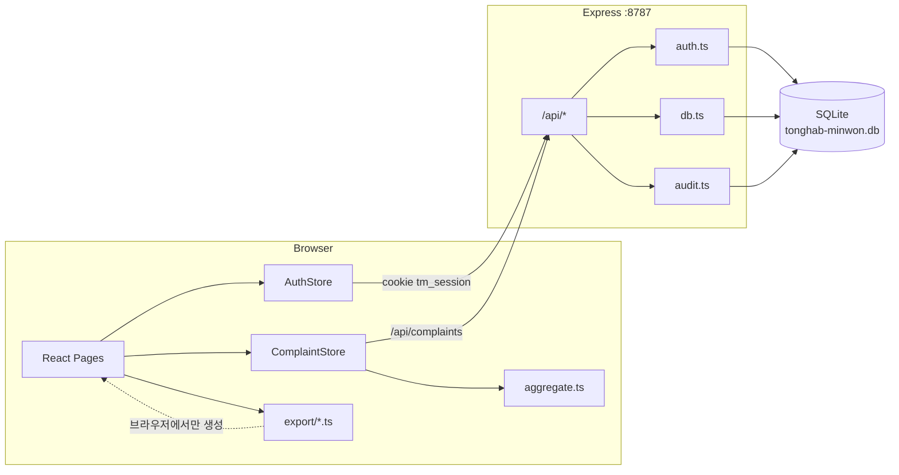
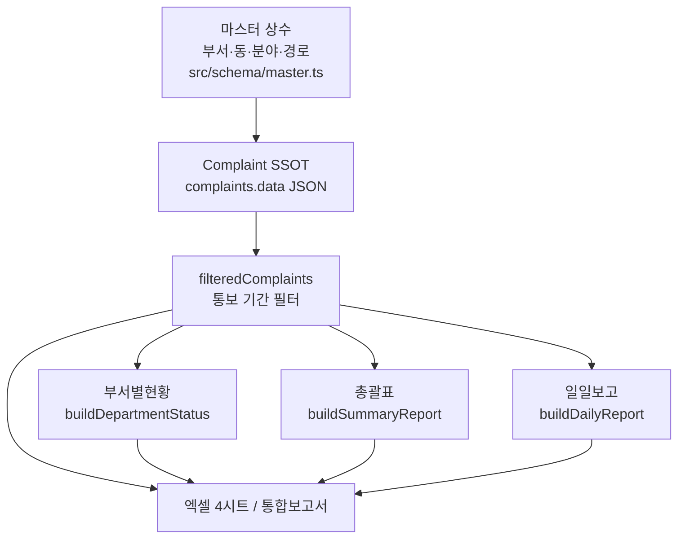

# 통합민원정보 — 아키텍처

> 코드 기준일: 2026-09-15  
> 관련 문서: [ERD](./erd.md) · [데이터 흐름(Mermaid)](./data-flow.md) · [사진·민원카드 정책](./photo-hwpx-policy.md) · [보고서 스키마](./report-schema.md)

## 1. 개요

전주시 생활민원 엑셀 보고서(관리대장 → 부서별현황 → 총괄표 → 일일보고)를 웹으로 재현한 **로컬 민원 관리·집계·엑셀 내보내기** 앱입니다.

| 원칙 | 설명 |
|---|---|
| SSOT | **관리대장(`Complaint`)만 쓰기**. 부서별·총괄·일일보고는 조회 시점 집계 |
| 로컬 우선 | SQLite 파일 DB, Windows 포터블(Node 런타임 내장) 배포 |
| 클라이언트 집계 | `/api/reports/*` 없음. `src/schema/aggregate.ts`에서 파생 |

기본 로그인: `admin` / `admin`

---

## 2. 기술 스택

| 계층 | 기술 |
|---|---|
| Frontend | React 19, React Router 7, Vite 7, TypeScript |
| Backend | Express 5 (`server/`), `tsx` 실행 |
| DB | Node 내장 `node:sqlite` (`DatabaseSync`), `data/tonghab-minwon.db` |
| Excel | ExcelJS + file-saver (브라우저 생성) |
| 기타 | HWPX 임포트(`jszip`), scrypt 비밀번호 해시 |

---

## 3. 실행·배포

| 모드 | 명령 |
|---|---|
| 개발 | `npm run dev` → API **8787** + Vite(프록시 `/api` → 8787) |
| API만 | `npm run dev:api` / `npm run start:api` |
| 프론트 빌드 | `npm run build` → `dist/` |
| Windows 포터블 | `npm run release:win` → `scripts/build-release.mjs` |

**포터블 패키징 흐름**

1. Vite 빌드 (`dist/`)
2. Node 22 win-x64 `node.exe` 내장 (`runtime/`)
3. esbuild로 `server/index.ts` → `server.cjs` (`node:sqlite` external)
4. `my-minwon-server.bat` (HOST=`127.0.0.1`, PORT=`8787`, production)
5. ZIP: `tonghab-minwon-info-windows-portable.zip` → GitHub Release

프로덕션에서는 Express가 `dist/` 정적 파일 + SPA fallback을 함께 서빙합니다.

---

## 4. 디렉터리 구조

```
tonghab-minwon-info/
├── server/                 # Express API, SQLite, 인증·감사
│   ├── index.ts            # 라우트·미들웨어
│   ├── db.ts               # complaints CRUD
│   ├── auth.ts             # users / sessions / settings
│   └── audit.ts            # audit_logs
├── src/
│   ├── App.tsx             # 라우팅·Auth/Complaint Provider
│   ├── api/                # fetch 래퍼 (credentials: include)
│   ├── schema/             # 도메인 타입·마스터·집계·seed
│   ├── store/              # AuthStore, ComplaintStore
│   ├── pages/              # 화면
│   ├── export/             # 시트별·통합 엑셀
│   ├── components/         # AppLayout, HWPX, 사진 UI
│   ├── import/             # HWPX 파서
│   └── lib/                # 마스킹 등
├── scripts/build-release.mjs
├── data/                   # 런타임 DB (gitignore)
└── docs/                   # 설계·아키텍처 문서
```

---

## 5. 런타임 아키텍처



### 5.1 인증·세션

1. `POST /api/auth/login` → scrypt 검증 → `sessions` 토큰 삽입 → HttpOnly 쿠키 `tm_session`
2. 부트스트랩: `GET /api/auth/me`
3. 만료 임박·활동 시 `POST /api/auth/refresh` (TTL은 `app_settings.session_ttl_minutes`, 기본 30분·최소 10분)
4. 비밀번호 변경 시 다른 세션 revoke, 현재 세션은 유지·갱신
5. 인증: 쿠키 또는 `Authorization: Bearer`

### 5.2 프론트 라우트

| Path | Page | 역할 |
|---|---|---|
| `/login` | LoginPage | 비로그인 |
| `/` | DashboardPage | KPI·추이·통합 엑셀 |
| `/ledger` | LedgerPage | 관리대장 입력·수정·삭제 |
| `/departments` | DepartmentPage | 부서별 현황 |
| `/summary` | SummaryPage | 총괄표 |
| `/daily` | DailyPage | 일일보고 |
| `/audit` | AuditPage | 감사 로그 |
| `/settings` | SettingsPage | TTL·비밀번호·DB 초기화 |

네비게이션 순서(사이드바): 홈 → 관리대장 → 부서별현황 → 총괄표 → 일일보고 → 감사로그 → 설정

### 5.3 API 엔드포인트

| Method | Path | Auth | 설명 |
|---|---|---|---|
| GET | `/api/health` | — | 헬스체크 |
| POST | `/api/auth/login` | — | 로그인 |
| POST | `/api/auth/logout` | — | 로그아웃 |
| GET | `/api/auth/me` | 세션 | 현재 사용자 |
| POST | `/api/auth/refresh` | 세션 | TTL 연장 |
| POST | `/api/auth/change-password` | ✓ | 비밀번호 변경 |
| GET/PUT | `/api/settings` | ✓ | 세션 TTL |
| GET | `/api/audit` | ✓ | 감사 로그 |
| GET | `/api/complaints` | ✓ | 전체 목록 |
| PUT | `/api/complaints` | ✓ | upsert |
| POST | `/api/complaints` | ✓ | 단건 또는 일괄 |
| POST | `/api/complaints/replace` | ✓ | 전체 교체 |
| POST | `/api/complaints/reset-seed` | ✓+비밀번호 | 샘플 복원 |
| DELETE | `/api/complaints/:id` | ✓ | 삭제 |

> `docs/report-schema.md`에 언급된 `/api/reports/*`, freeze 스냅샷은 **미구현**입니다.

---

## 6. 도메인·데이터 흐름



| 집계 함수 | 산출 | 내용 |
|---|---|---|
| `buildDepartmentStatus` | `DepartmentStatusRow[]` | 부서별 건수/완료/미처리/처리율 |
| `buildSummaryReport` | `SummaryReport` | 처리개요·기간·경로·분야·실국 |
| `buildDailyReport` | `DailyReport` | 경로×분야 매트릭스 + 동별 시민불편 |

기간 필터: 헤더의 `periodFrom`/`periodTo`가 `notifiedAt` 기준으로 `filteredComplaints`를 만든 뒤 집계·엑셀에 반영됩니다.

상세 코드/라벨은 [report-schema.md](./report-schema.md) 참고.

---

## 7. 엑셀 내보내기

모두 **브라우저**에서 생성합니다. 서버 엑셀 API 없음.

| 모듈 | 시트명 | 단건 파일 | 호출 |
|---|---|---|---|
| `ledgerExcel.ts` | `(관리대장)` | `생활민원_관리대장_YYYYMMDD.xlsx` | LedgerPage |
| `departmentExcel.ts` | `(부서별현황)` | `부서별_처리현황_YYYYMMDD.xlsx` | DepartmentPage |
| `summaryExcel.ts` | `(총괄표)` | `생활민원_처리현황_총괄표_YYYYMMDD.xlsx` | SummaryPage |
| `dailyExcel.ts` | `(일일보고)` | `생활민원_일일보고_YYYYMMDD.xlsx` | DailyPage |
| `combinedExcel.ts` | 위 4시트 | `생활민원_통합보고서_YYYYMMDD.xlsx` | DashboardPage |

통합: `addLedgerSheet` → `addDepartmentSheet` → `addSummarySheet` → `addDailySheet` → `saveAs`

---

## 8. 사진 · 민원카드(HWPX)

| 원칙 | 내용 |
|---|---|
| HWPX 원본 | 보관하지 않음. 가져오기 시 브라우저 파싱만 |
| 사진 | `data:image/...;base64` 로 `Complaint.photos[]`에 임베드 → `complaints.data` |
| 파일 스토어 | 없음 (업로드 API·디스크 경로 없음) |
| 압축 | HWPX `BinData` → JPEG maxWidth 720 / quality 0.72 |
| 검수 | 휴리스틱 초안 → 사용자 확인 후 일괄 등록 |

상세 정책·role·레거시 필드·한계는 **[사진·민원카드 처리 정책](./photo-hwpx-policy.md)** 참고.

---

## 9. 프론트 스토어

| Store | 책임 |
|---|---|
| `AuthStore` | 로그인·세션·자동 refresh. `ComplaintProvider`는 로그인 후에만 마운트 |
| `ComplaintStore` | CRUD API, 기간/보고일, `departmentStatus`/`summary`/`daily` useMemo 집계, seed 초기화 |

---

## 10. 구현 vs 문서 주의점

- 마스터(부서·동·분야 등)는 **DB 테이블이 아니라** TypeScript 상수입니다.
- 민원 본문·사진은 `complaints.data` **JSON 한 컬럼**에 저장합니다 (`notified_at`/`received_at`은 인덱스용 미러).
- `DailyReportSnapshot` 타입/문서만 있고 DB·API 미구현입니다.
- DB 스키마·관계는 [erd.md](./erd.md) 참고.
