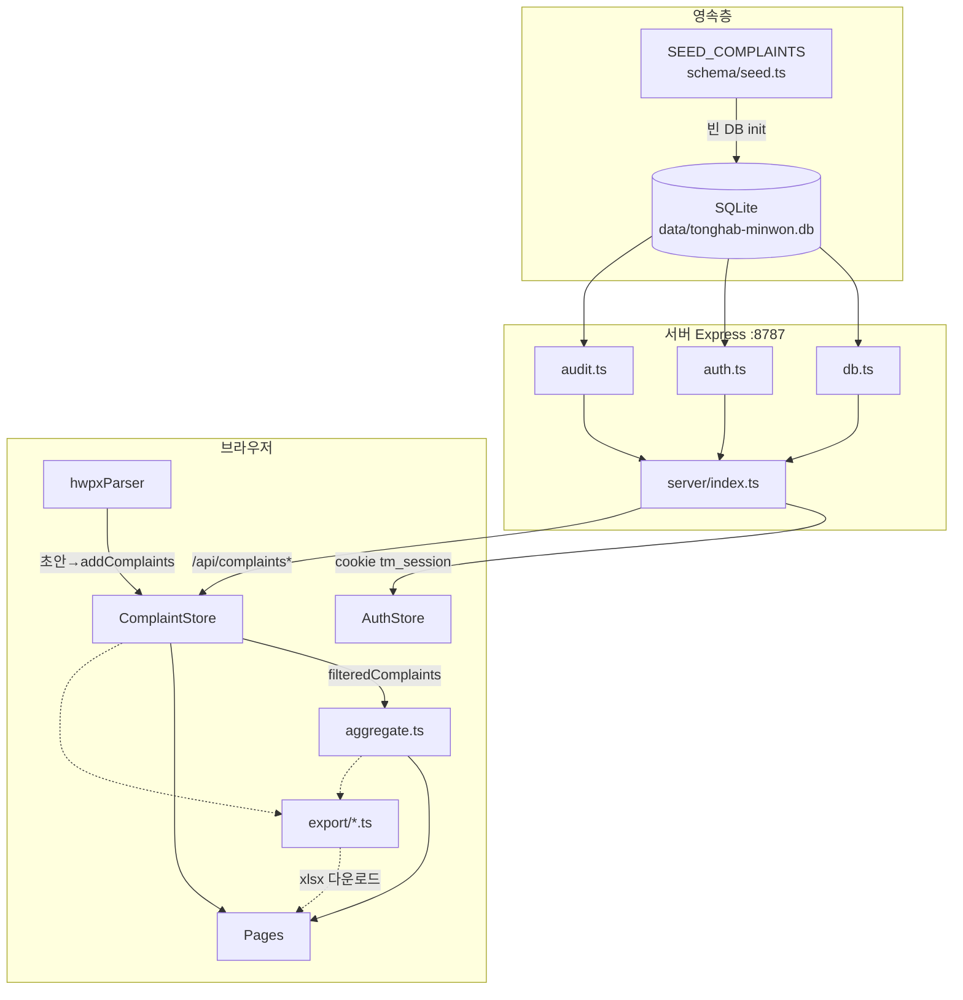
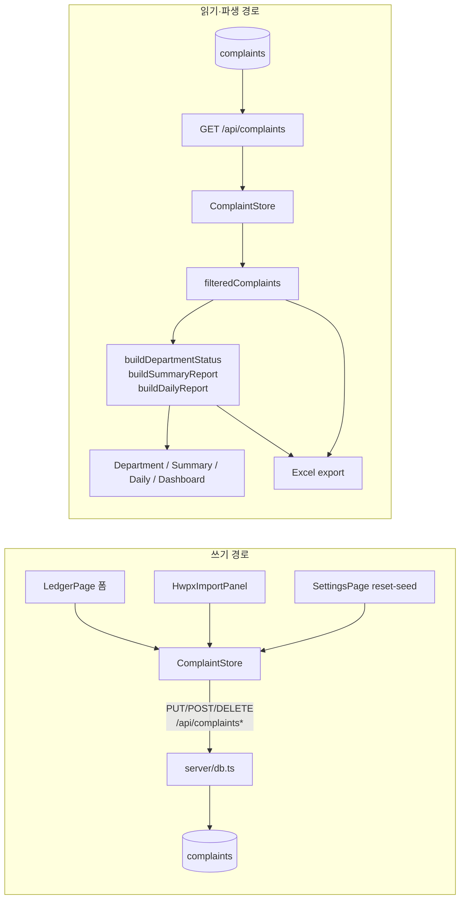
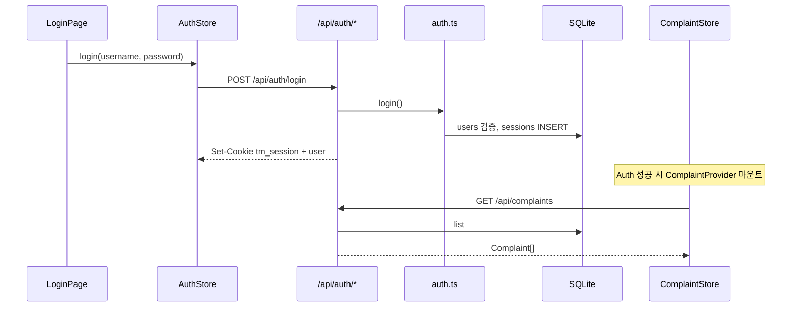
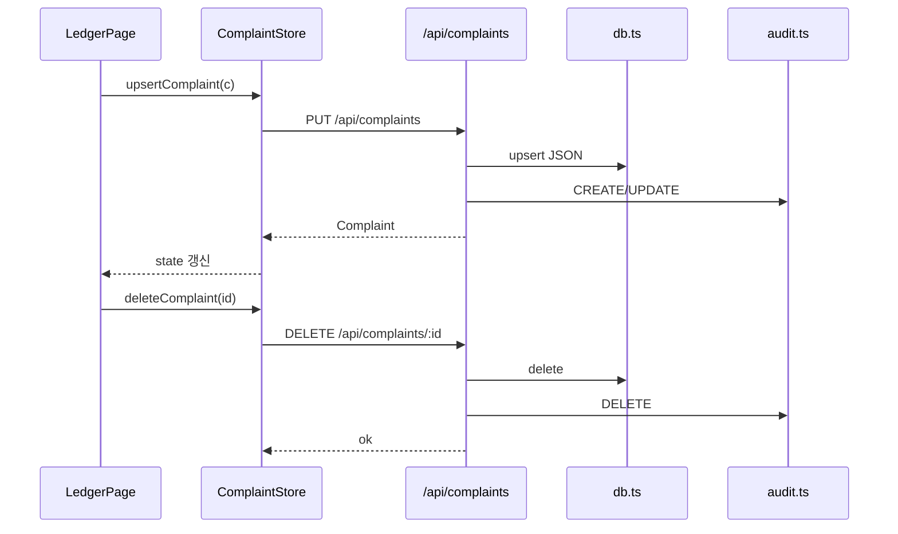
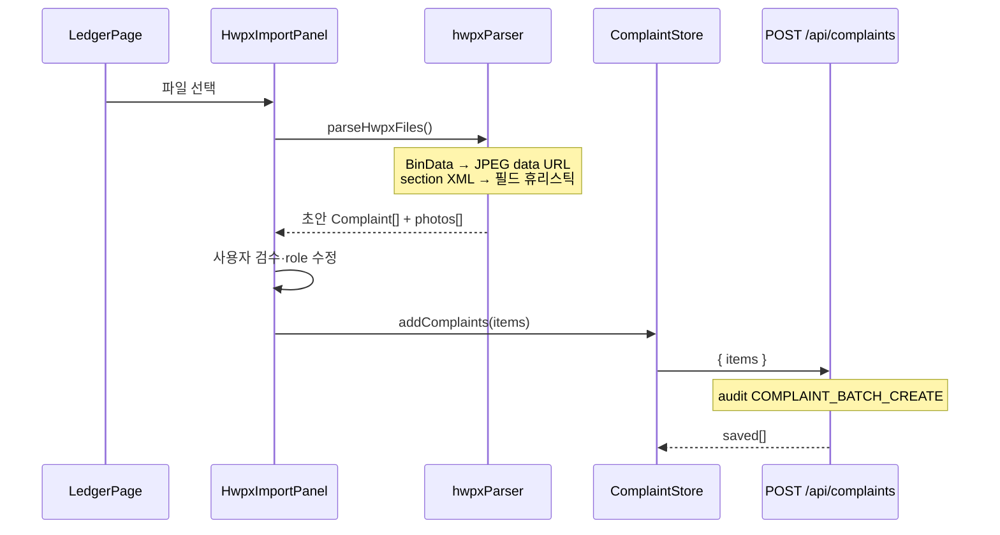
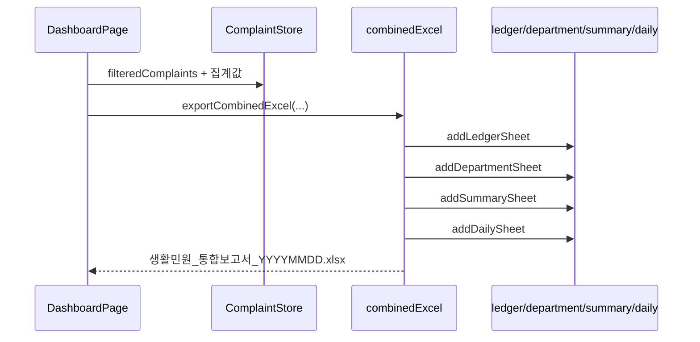
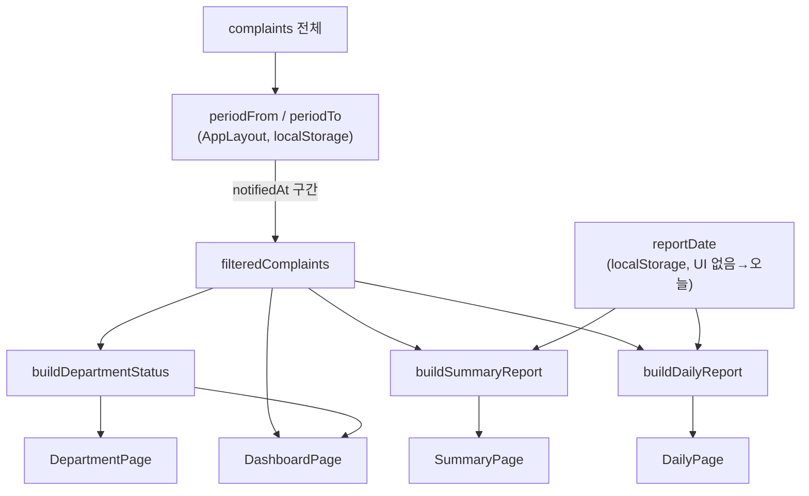
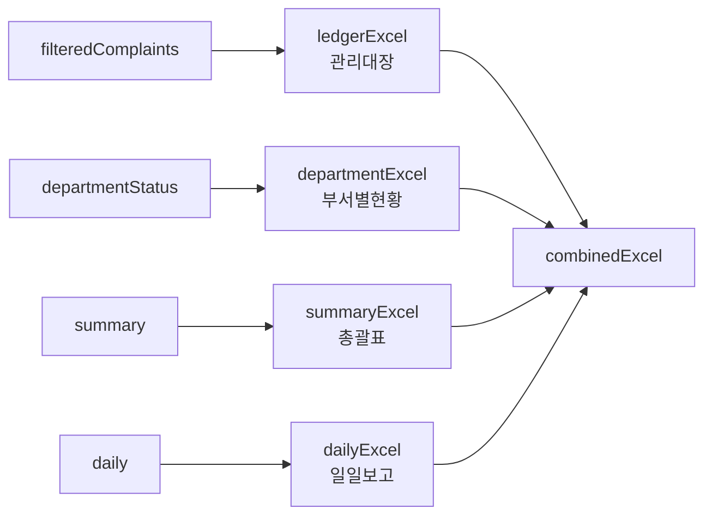
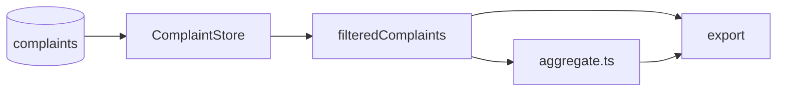

# 통합민원정보 — 데이터 흐름 (Mermaid 표준)

> 코드 기준일: 2026-09-15  
> 관련 문서: [아키텍처](./architecture.md) · [ERD](./erd.md) · [사진·민원카드 정책](./photo-hwpx-policy.md) · [보고서 스키마](./report-schema.md) · [PRD](./PRD.md)

이 문서는 **프로젝트 데이터 흐름을 Mermaid로 표기할 때의 표준**입니다.  
다른 문서·이슈·PR에 흐름도를 넣을 때 아래 **표기 규칙**과 **다이어그램 템플릿**을 그대로 재사용합니다.

---

## 0. Mermaid 표기 규칙

### 0.1 다이어그램 종류

| 용도 | Mermaid | 사용처 |
|---|---|---|
| 계층·파이프라인 | `flowchart TB` / `LR` | 전체 SSOT, 집계·엑셀 |
| 사용자·API 시퀀스 | `sequenceDiagram` | 로그인, CRUD, HWPX, export |
| 저장 구조 | `erDiagram` | SQLite·도메인 (상세는 [erd.md](./erd.md)) |

### 0.2 노드 ID·라벨

| 계층 | ID 접두/이름 | 라벨 예 |
|---|---|---|
| UI 페이지 | `Pg*` | `PgDash[DashboardPage]` |
| Store | `St*` | `StComplaint[ComplaintStore]` |
| API client | `Api*` | `ApiComp[/api/complaints]` |
| Server 모듈 | `Srv*` | `SrvDb[db.ts]` |
| SQLite | `Db*` | `DbSqlite[(tonghab-minwon.db)]` |
| 집계 | `Agg*` | `AggBuild[aggregate.ts]` |
| Export | `Xls*` | `XlsCombined[combinedExcel]` |
| Import | `Imp*` | `ImpHwpx[hwpxParser]` |

- **실선 `-->`**: 동기 호출·필수 데이터 경로  
- **점선 `-.->`**: 파생·다운로드·부가 경로  
- **굵은 박스 `[( )]`**: 영속 저장소  
- **대괄호 `[ ]`**: 프로세스·모듈  
- **중괄호 `{ }`**: 분기(필요 시)

### 0.3 핵심 원칙 (문구 고정)

1. **SSOT = `Complaint`만 쓰기** (SQLite `complaints.data` JSON).  
2. **부서별·총괄·일일 = 조회 시점 클라이언트 집계** (`src/schema/aggregate.ts`).  
3. **엑셀 = 브라우저 전용** (ExcelJS). `/api/reports/*` 없음.  
4. **기간 필터 = `notifiedAt` ∈ [periodFrom, periodTo]** → `filteredComplaints`.  
5. **보고일 `reportDate`** = 총괄 기간버킷·일일「일접수」기준 (UI 변경 없음, 기본=오늘).

---

## 1. 전체 데이터 파이프라인 (표준)



---

## 2. 계층별 읽기·쓰기



---

## 3. 시퀀스 표준

### 3.1 로그인 · 부트스트랩



### 3.2 민원 CRUD (관리대장)



### 3.3 HWPX 임포트 (브라우저 전용 파싱)

정책 전문: [photo-hwpx-policy.md](./photo-hwpx-policy.md) (원본 미보관 · data URL 임베드 · JPEG 압축 · 검수 후 등록)



### 3.4 통합 엑셀 내보내기



---

## 4. 기간 · 보고일 · 집계



| 개념 | 저장 | 필터 기준 | 영향 |
|---|---|---|---|
| 기간 | `tonghab-minwon-period-*` | `Complaint.notifiedAt` | 화면·집계·엑셀 입력 집합 |
| 보고일 | `tonghab-minwon-report-date` | 총괄 버킷·일일 일접수 | 집계 로직 내부 기준일 |

---

## 5. 엑셀 시트 매핑 (표준)



| 순서 | 시트명 | 모듈 | 단건 호출 |
|---|---|---|---|
| 1 | 관리대장 | `ledgerExcel.ts` | LedgerPage |
| 2 | (부서별현황) | `departmentExcel.ts` | DepartmentPage |
| 3 | (총괄표) | `summaryExcel.ts` | SummaryPage |
| 4 | (일일보고) | `dailyExcel.ts` | DailyPage |
| — | 위 4장 합본 | `combinedExcel.ts` | DashboardPage |

---

## 6. 인증·설정·감사 (민원 외 흐름)

```mermaid
flowchart TB
  PgSet[SettingsPage] -->|TTL·비밀번호| ApiAuth[/api/settings<br/>/api/auth/change-password]
  PgSet -->|DB 초기화| ApiReset[/api/complaints/reset-seed]
  ApiAuth --> DbAuth[(users / sessions / app_settings)]
  ApiReset --> DbComp[(complaints만 샘플 복원)]

  PgAudit[AuditPage] --> ApiAudit[/api/audit]
  ApiAudit --> DbAud[(audit_logs)]
```

감사는 민원 CRUD·배치·설정 변경 등 **서버 API 성공 시** 기록. HWPX/엑셀 파싱 자체는 감사하지 않음.

---

## 7. 페이지 ↔ Store 소비 표 (표준 참조)

| Page | 읽기 | 쓰기 |
|---|---|---|
| DashboardPage | `filteredComplaints`, period, 집계(간접) | — / 통합 export |
| LedgerPage | `filteredComplaints` | upsert, delete, HWPX `addComplaints` |
| DepartmentPage | `filteredComplaints`, `departmentStatus` | — |
| SummaryPage | `summary` | — |
| DailyPage | `daily`, `reportDate`(표시) | — |
| SettingsPage | auth settings | TTL, 비밀번호, `resetSeed` |
| AuditPage | `api/audit` | — |
| LoginPage | AuthStore | login |

---

## 8. 파일 맵 (흐름도 노드 → 경로)

| 노드 | 경로 |
|---|---|
| AuthStore | `src/store/AuthStore.tsx` |
| ComplaintStore | `src/store/ComplaintStore.tsx` |
| aggregate | `src/schema/aggregate.ts` |
| seed | `src/schema/seed.ts` |
| API client | `src/api/{auth,complaints,audit,client}.ts` |
| Server | `server/{index,db,auth,audit}.ts` |
| HWPX | `src/import/hwpxParser.ts`, `src/components/HwpxImportPanel.tsx` |
| Export | `src/export/{ledger,department,summary,daily,combined}Excel.ts` |
| Layout 기간 | `src/components/AppLayout.tsx` |

---

## 9. 복사해 쓰는 미니 템플릿

문서·이슈에 짧게 넣을 때:

````markdown

````

상세 ER은 [erd.md](./erd.md), 런타임·API 목록은 [architecture.md](./architecture.md)를 따릅니다.
