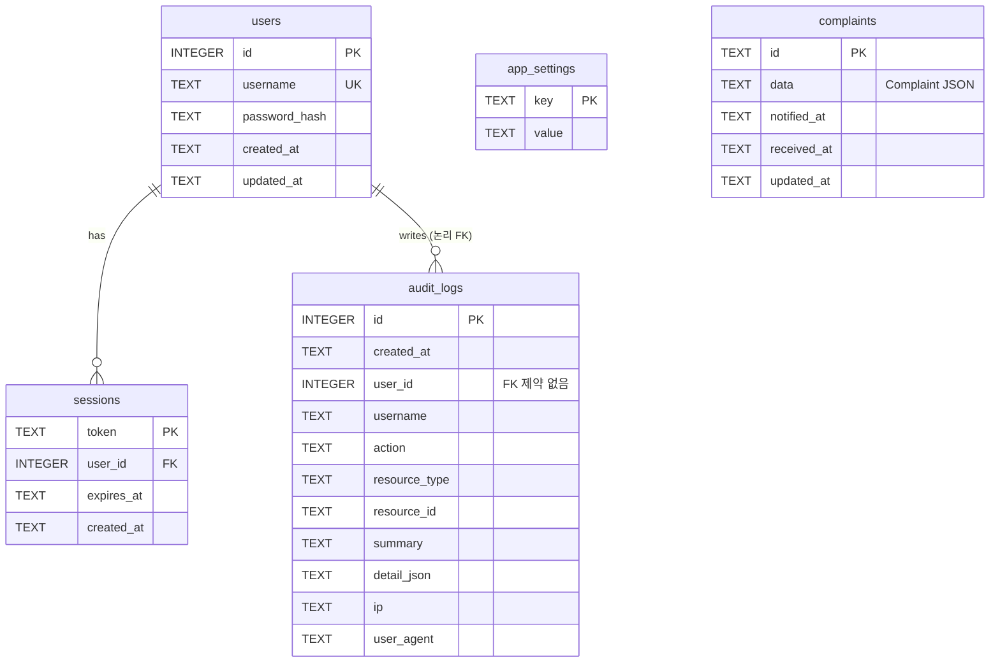
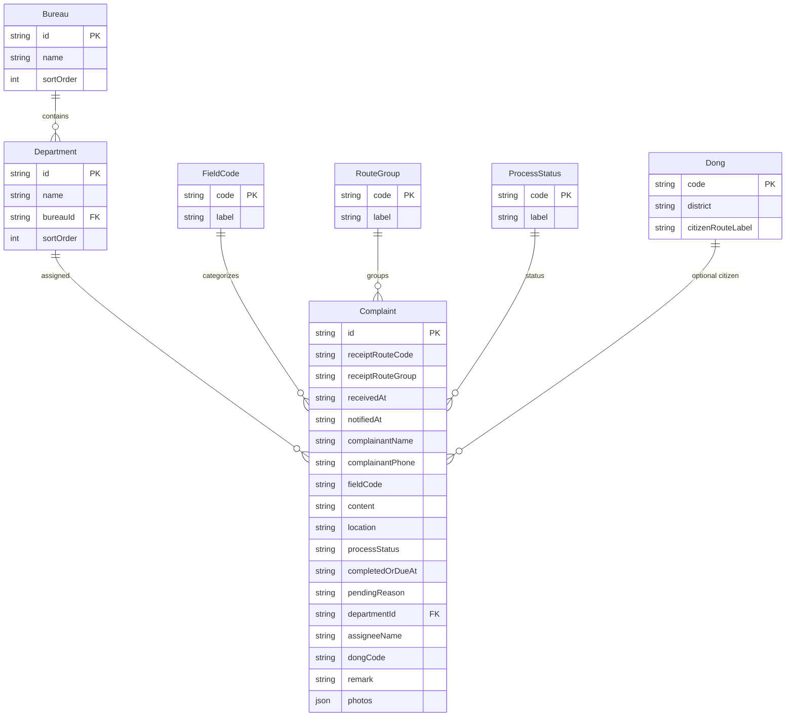
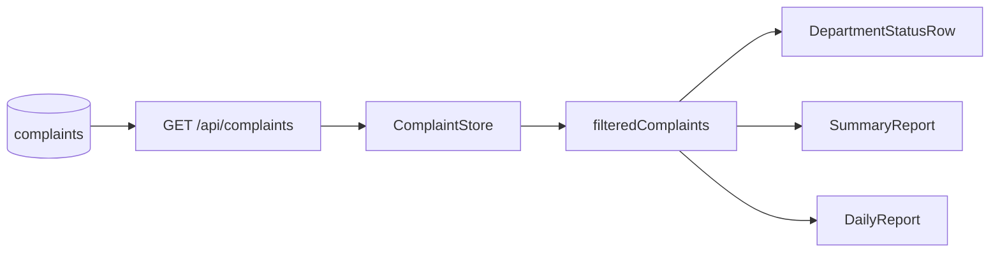

# 통합민원정보 — ERD

> 코드 기준일: 2026-09-15  
> 스키마 원천: `server/db.ts`, `server/auth.ts`, `server/audit.ts`  
> 관련 문서: [아키텍처](./architecture.md) · [데이터 흐름(Mermaid)](./data-flow.md) · [사진·민원카드 정책](./photo-hwpx-policy.md) · [저장 용량·성능 분산 방향](./storage-scaling-decision.md) · [보고서 스키마](./report-schema.md)

마이그레이션 파일은 없습니다. 기동 시 `CREATE TABLE IF NOT EXISTS`만 실행합니다.  
`PRAGMA journal_mode = WAL`, `PRAGMA foreign_keys = ON`.

DB 파일: `data/tonghab-minwon.db` (환경변수 `TM_DATA_DIR`로 디렉터리 변경 가능)  
아카이브: `data/archives/tonghab-minwon-{label}.db` (설정 → 아카이브 전환)

---

## 1. 물리 ERD (SQLite)



### 관계 요약

| 관계 | 종류 | 비고 |
|---|---|---|
| `users` → `sessions` | 1:N | `REFERENCES users(id) ON DELETE CASCADE` |
| `users` → `audit_logs` | 1:N (논리) | DB FK 없음. `user_id`/`username` 스냅샷 저장 |
| `complaints` | 독립 | 도메인 민원 SSOT. JSON blob |
| `app_settings` | 독립 | KV (`session_ttl_minutes` 등) |

---

## 2. 테이블 정의

### 2.1 `complaints`

```sql
CREATE TABLE IF NOT EXISTS complaints (
  id TEXT PRIMARY KEY,
  data TEXT NOT NULL,              -- Complaint JSON 전체
  notified_at TEXT,               -- 인덱스·정렬용 미러
  received_at TEXT NOT NULL,
  updated_at TEXT NOT NULL DEFAULT (datetime('now'))
);

CREATE INDEX IF NOT EXISTS idx_complaints_notified ON complaints(notified_at);
CREATE INDEX IF NOT EXISTS idx_complaints_received ON complaints(received_at);
```

- **신규** DB 파일이면 `SEED_COMPLAINTS` 샘플 삽입. 기존 파일에서 민원 0건이어도 샘플을 다시 넣지 않음.
- `reset-seed` 시 민원·보고 스냅샷을 비우고 민원만 샘플로 복원(계정·세션·감사·설정 유지). 감사 로그는 API에서 별도 비움.
- 아카이브 전환 시 활성 `complaints`만 비움(스냅샷·감사·계정 유지). 보관본은 `archives/` 파일.

### 2.2 `users`

```sql
CREATE TABLE IF NOT EXISTS users (
  id INTEGER PRIMARY KEY AUTOINCREMENT,
  username TEXT NOT NULL UNIQUE,
  password_hash TEXT NOT NULL,     -- salt:scrypt hex
  created_at TEXT NOT NULL DEFAULT (datetime('now')),
  updated_at TEXT NOT NULL DEFAULT (datetime('now'))
);
```

### 2.3 `sessions`

```sql
CREATE TABLE IF NOT EXISTS sessions (
  token TEXT PRIMARY KEY,
  user_id INTEGER NOT NULL REFERENCES users(id) ON DELETE CASCADE,
  expires_at TEXT NOT NULL,
  created_at TEXT NOT NULL DEFAULT (datetime('now'))
);

CREATE INDEX IF NOT EXISTS idx_sessions_expires ON sessions(expires_at);
```

### 2.4 `app_settings`

```sql
CREATE TABLE IF NOT EXISTS app_settings (
  key TEXT PRIMARY KEY,
  value TEXT NOT NULL
);
-- seed: key = 'session_ttl_minutes', value = '30'
```

### 2.5 `audit_logs`

```sql
CREATE TABLE IF NOT EXISTS audit_logs (
  id INTEGER PRIMARY KEY AUTOINCREMENT,
  created_at TEXT NOT NULL DEFAULT (datetime('now')),
  user_id INTEGER,
  username TEXT,
  action TEXT NOT NULL,
  resource_type TEXT,
  resource_id TEXT,
  summary TEXT NOT NULL,
  detail_json TEXT,
  ip TEXT,
  user_agent TEXT
);

CREATE INDEX IF NOT EXISTS idx_audit_created ON audit_logs(created_at DESC);
CREATE INDEX IF NOT EXISTS idx_audit_action ON audit_logs(action);
CREATE INDEX IF NOT EXISTS idx_audit_username ON audit_logs(username);
```

---

## 3. 도메인 논리 모델 (`complaints.data` JSON)

물리 테이블은 1개이지만, JSON 안의 `Complaint`는 코드 마스터와 논리적으로 연결됩니다.  
마스터는 **DB에 없고** `src/schema/master.ts` 상수입니다.



### Complaint JSON 주요 필드

| 필드 | 타입 | 설명 |
|---|---|---|
| `id` | string | PK (= `complaints.id`) |
| `receiptRouteCode` | string | 접수경로 세부 코드 |
| `receiptRouteGroup` | RouteGroup | MOBILE / DUTY / CITIZEN / OFFICIAL / ETC |
| `receivedAt` | string (ISO date) | 접수일 |
| `notifiedAt` | string \| null | 통보일 (기간 필터 기준) |
| `complainantName` / `Phone` | string | 민원인 |
| `fieldCode` | FieldCode | ROAD, PARK, CLEAN, TRAFFIC, BUILDING, ETC |
| `content` / `location` | string | 내용·위치 |
| `photos[]` | ComplaintPhoto | role: receipt \| before \| after \| other. **url은 data URL**, 별도 파일 스토어 없음 |
| `photoReceiptUrl` 등 | string \| null | deprecated. `syncPhotoFields`로 `photos`와 동기화 |
| `processStatus` | ProcessStatus \| null | DONE / SCHEDULED / IMPOSSIBLE |
| `completedOrDueAt` | string \| null | 완료일·예정일 |
| `pendingReason` | string \| null | 미처리 사유 |
| `departmentId` | string | → Department.id |
| `assigneeName` | string \| null | 담당자 |
| `dongCode` | string \| null | 시민불편 동 코드 |
| `remark` | string \| null | 비고 |

사진·HWPX 처리 정책 전문: [photo-hwpx-policy.md](./photo-hwpx-policy.md)

### 코드 값 (요약)

| 타입 | 값 |
|---|---|
| `FieldCode` | ROAD, PARK, CLEAN, TRAFFIC, BUILDING, ETC |
| `ProcessStatus` | DONE, SCHEDULED, IMPOSSIBLE |
| `RouteGroup` | MOBILE, DUTY, CITIZEN, OFFICIAL, ETC |
| `DistrictCode` | WANSAN, DEOKJIN |
| `PeriodBucketKey` | D1_3, D4_5, D6_7, D8_10, D_OVER_10, SCHEDULED, IMPOSSIBLE |

---

## 4. 파생 집계 (비저장)

DB에 별도 집계 테이블이 없습니다. 클라이언트 `ComplaintStore`가 `filteredComplaints`로 아래를 계산합니다.



| 산출물 | 저장 여부 |
|---|---|
| `DepartmentStatusRow[]` | 메모리 only |
| `SummaryReport` | 메모리 only |
| `DailyReport` | 메모리 only |
| `DailyReportSnapshot` | 타입만 존재, **미구현** |

---

## 5. 인덱스 목록

| 테이블 | 인덱스 |
|---|---|
| `complaints` | `idx_complaints_notified`, `idx_complaints_received` |
| `sessions` | `idx_sessions_expires` |
| `audit_logs` | `idx_audit_created`, `idx_audit_action`, `idx_audit_username` |
| `users` | `username` UNIQUE |
| `app_settings` | PK(`key`) |
