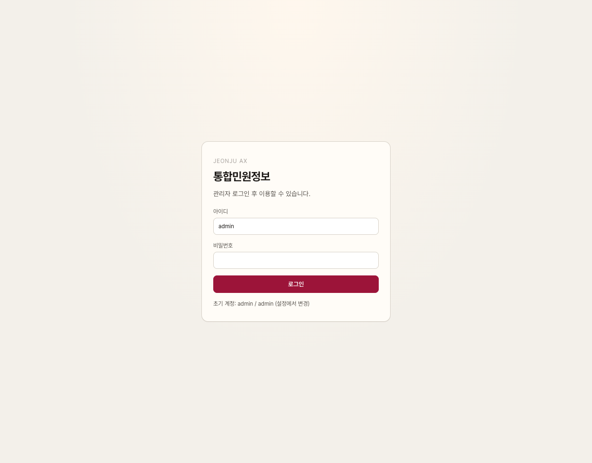
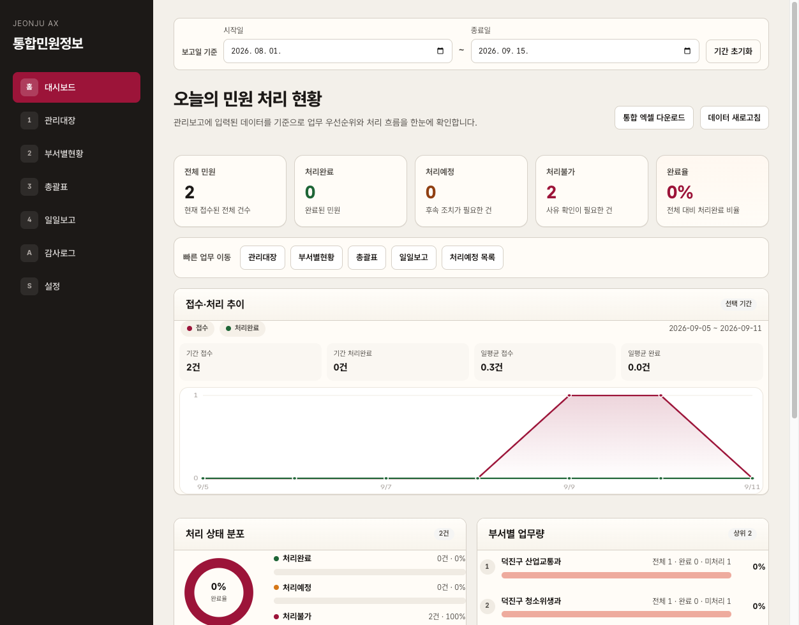
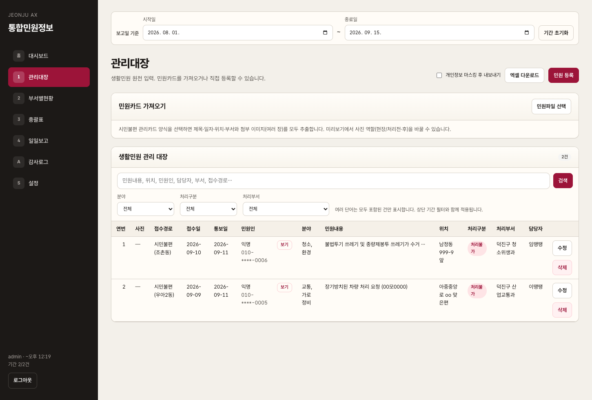
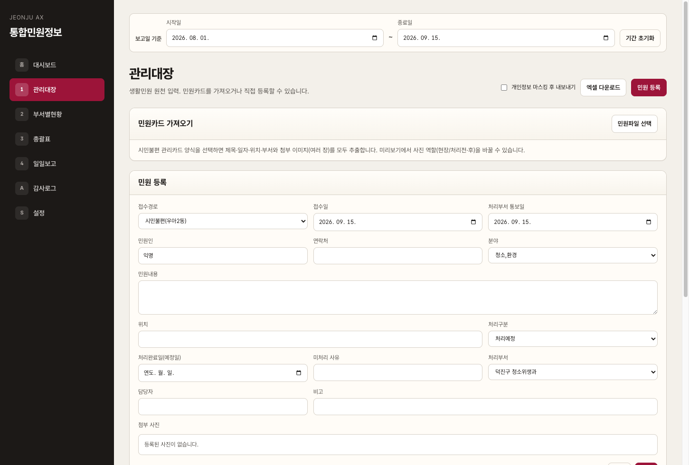
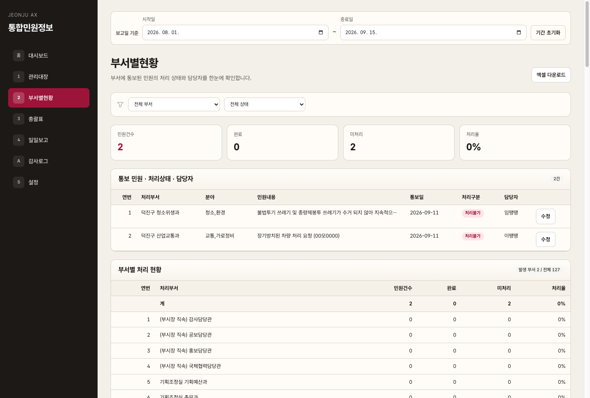
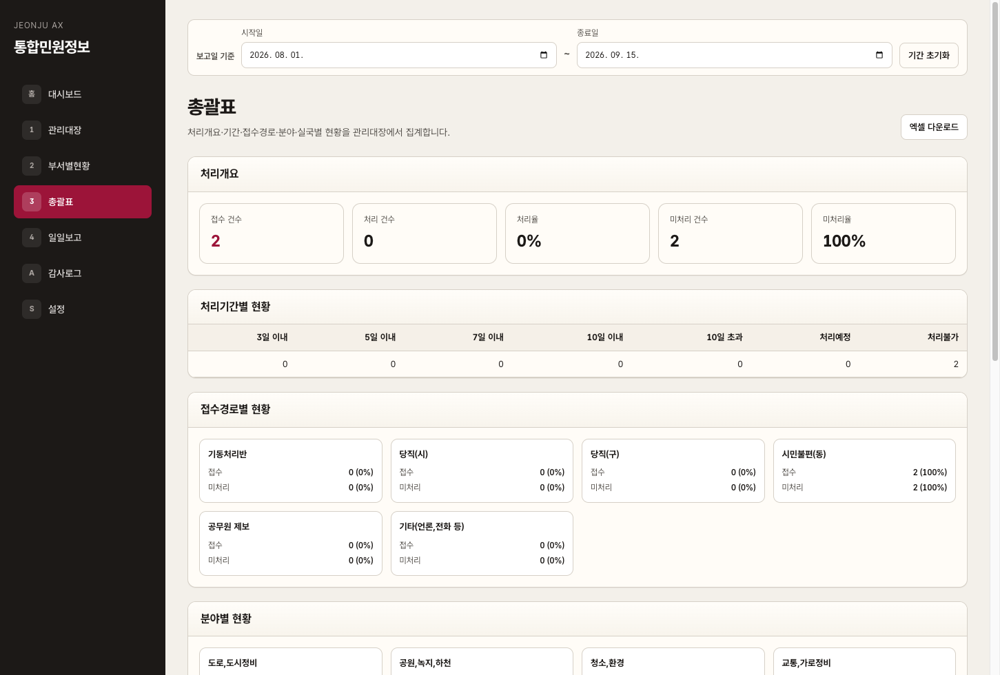
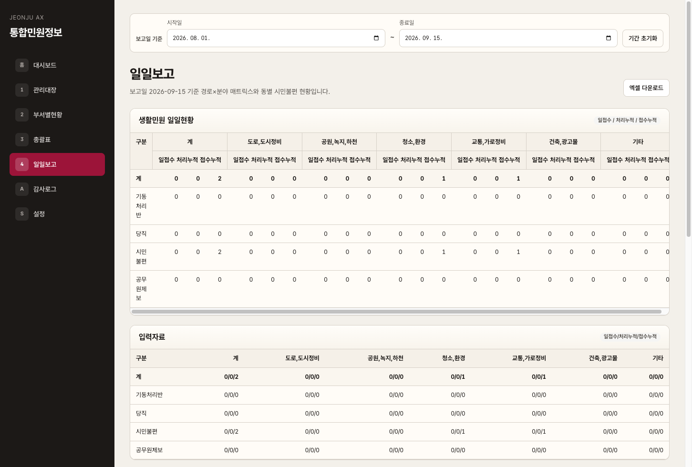
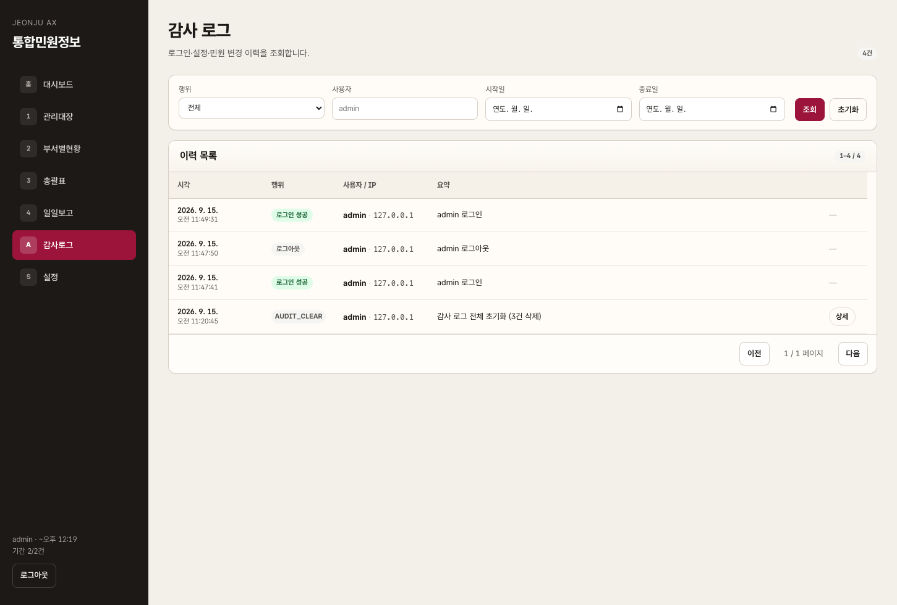
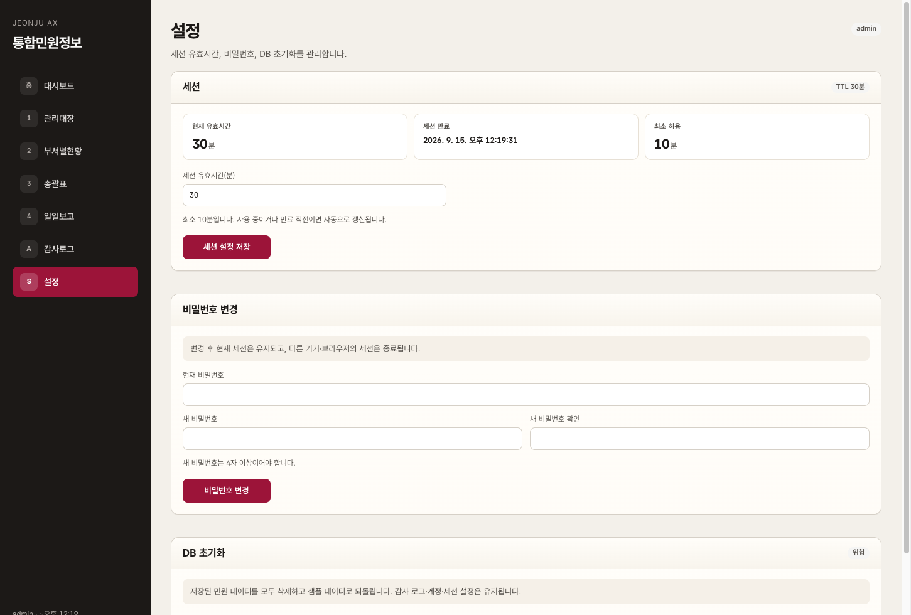

# 사이트 전체 스냅샷

캡처 일시: 2026-09-15  
기준 URL: `http://localhost:5173/`  
계정: `admin` / `admin`  
기간 필터: 2026-08-01 ~ 2026-09-15 (샘플 민원 2건)

## 화면 목록

| # | 파일 | 경로 | 설명 |
|---|------|------|------|
| 00 | [00-login.png](./00-login.png) | `/login` | 관리자 로그인 |
| 01 | [01-dashboard.png](./01-dashboard.png) | `/` | 홈 · 대시보드 (KPI, 추이, 상태·부서) |
| 02 | [02-ledger.png](./02-ledger.png) | `/ledger` | 관리대장 (검색·필터·원장 목록) |
| 02b | [02b-ledger-register.png](./02b-ledger-register.png) | `/ledger` | 관리대장 · 민원 등록 폼 |
| 03 | [03-departments.png](./03-departments.png) | `/departments` | 부서별현황 |
| 04 | [04-summary.png](./04-summary.png) | `/summary` | 총괄표 (개요·경로·분야·실국) |
| 05 | [05-daily.png](./05-daily.png) | `/daily` | 일일보고 (경로×분야 매트릭스) |
| 06 | [06-audit.png](./06-audit.png) | `/audit` | 감사로그 |
| 07 | [07-settings.png](./07-settings.png) | `/settings` | 설정 (세션·비밀번호·DB 초기화) |

## 메뉴 구조

```
로그인 → 사이드바
  홈 대시보드
  1 관리대장 (+ 민원 등록 / HWPX 가져오기)
  2 부서별현황
  3 총괄표
  4 일일보고
  A 감사로그
  S 설정
```

## 미리보기

### 00 로그인


### 01 대시보드


### 02 관리대장


### 02b 민원 등록


### 03 부서별현황


### 04 총괄표


### 05 일일보고


### 06 감사로그


### 07 설정

